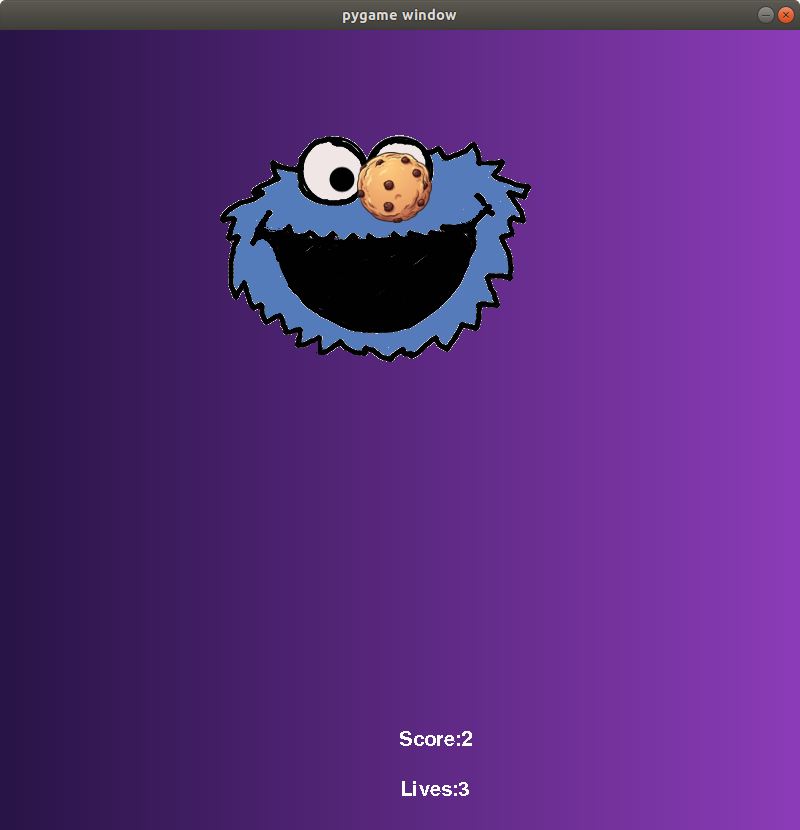
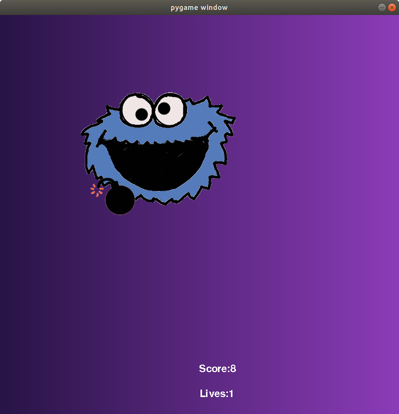
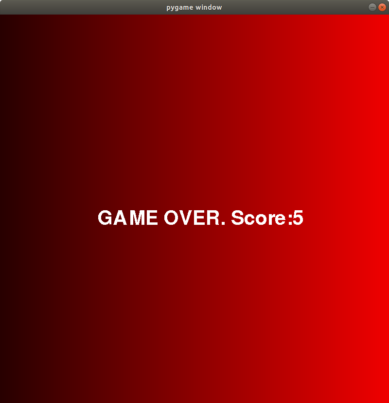
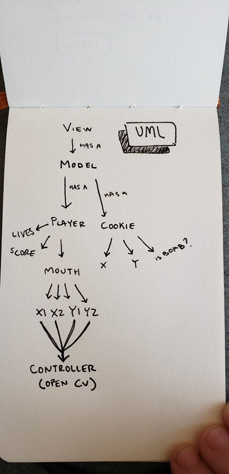

Project Overview

Cookie Monster uses facial recognition to track your face as a controller for a video game. Cookies fall from the screen and you try to catch them in your cookie monster's mouth by moving your own face around. Falling bombs complicate this.

Results

We made a super fun game! It's challenging and engaging to move around with your actual face because you actually have to dodge bombs in the physical world.

We ran into difficulties around the game being mirrored, but decided to keep it as it added an extra challenge. We also decided that it would be fun to add a game over screen, so we added that as well.

Implementation

Our main components can be seen in the uml diagram below:

They consist of the typical model, view, controller layout, where our controller is controlled by the players face. The player class has a mouth, so the cookie monster avatar will center on the mouth, instead of the face in general. The cookies themselves have their own coordinates, and a boolean to decide whether or not the cookie will be a bomb, which has a 20% chance of occurring.

Reflection

The project was well scoped and while we could have added more features and elements to the game as it stands it is quite fun and complete enough. We certainly could have done better with planned unit testing, instead we got a working program early and messed around with it. This actually gave us a better understanding of the tools and allowed for a more creative building of the program but was ultimately harder to debug.

We split work pretty evenly, and generally worked at the same time as each other. We used teletype to work on separate parts of code, but when someone was running into issues we would help them out. The biggest issue we ran into while working together was finding a time to meet.
